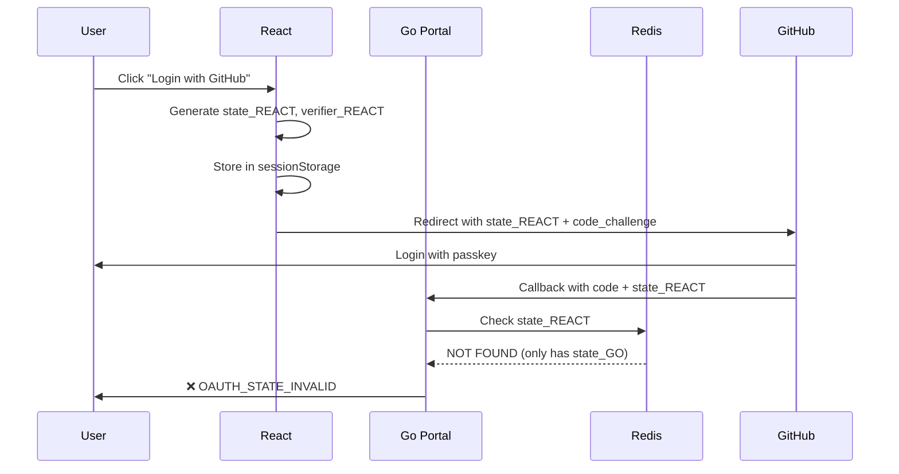

# OAuth PKCE Architecture Fix - The REAL Problem

## Current Broken Flow (Why State Validation Fails)



## Problem: TWO OAuth Initiators

1. **React (`LoginPage.jsx`)**: Generates its own state, stores in sessionStorage
2. **Go (`/auth/github/login`)**: Generates different state, stores in Redis

**GitHub receives state_REACT but Portal validates against state_GO → FAIL**

---

## Solution A: Pure Frontend PKCE (Recommended - Stateless)

### Architecture
```
React → GitHub (with encrypted state containing verifier) → React → Go backend (token exchange only)
```

### Changes Required:

#### 1. Remove Go Backend OAuth Initiation

**DELETE** or disable this endpoint:
```go
// apps/portal/handlers/auth_handler.go
func HandleGitHubOAuthLogin(c *gin.Context) {
    // THIS SHOULD NOT EXIST - React handles OAuth initiation
}
```

#### 2. Update React to Use Encrypted State

```jsx
// frontend/src/components/LoginPage.jsx
import { encryptVerifier, generateCodeChallenge } from '../utils/pkce';

const handleGitHubLogin = async () => {
  // Generate PKCE parameters
  const codeVerifier = generateCodeVerifier();
  const codeChallenge = await generateCodeChallenge(codeVerifier);
  
  // Encrypt verifier into state (AES-GCM with session key)
  const encryptedState = await encryptVerifier(codeVerifier);
  
  // NO sessionStorage - everything in encrypted state
  const params = new URLSearchParams({
    client_id: import.meta.env.VITE_GITHUB_CLIENT_ID,
    redirect_uri: window.location.origin + '/auth/github/callback',
    scope: 'user:email read:user',
    state: encryptedState,  // Contains verifier + timestamp
    code_challenge: codeChallenge,
    code_challenge_method: 'S256',
  });

  window.location.href = `https://github.com/login/oauth/authorize?${params}`;
};
```

#### 3. Update Callback to Decrypt State

```jsx
// frontend/src/components/OAuthCallback.jsx
import { decryptVerifier } from '../utils/pkce';

useEffect(() => {
  const code = searchParams.get('code');
  const encryptedState = searchParams.get('state');
  
  // Decrypt verifier from state
  const codeVerifier = await decryptVerifier(encryptedState);
  
  // Send to backend for token exchange
  const response = await fetch('/api/portal/auth/token', {
    method: 'POST',
    headers: { 'Content-Type': 'application/json' },
    body: JSON.stringify({
      code,
      code_verifier: codeVerifier,
      state: encryptedState,  // For audit logging
    }),
  });
});
```

#### 4. Update Go Backend (Token Exchange Only)

```go
// apps/portal/handlers/auth_handler.go
func HandleTokenExchange(c *gin.Context) {
    var req TokenRequest
    if err := c.ShouldBindJSON(&req); err != nil {
        c.JSON(400, gin.H{"error": "Invalid request"})
        return
    }

    // NO STATE VALIDATION IN REDIS - frontend already validated
    // Just exchange code for token with PKCE
    accessToken, err := exchangeCodeForToken(req.Code, req.CodeVerifier)
    if err != nil {
        c.JSON(500, gin.H{"error": "Token exchange failed"})
        return
    }

    // Create session, return JWT
    // ...
}
```

#### 5. Add Encryption Utilities

```javascript
// frontend/src/utils/pkce.js

// Use Web Crypto API for AES-GCM encryption
export async function encryptVerifier(verifier) {
  // Generate ephemeral key (derived from user's browser session)
  const encoder = new TextEncoder();
  const data = encoder.encode(JSON.stringify({
    verifier,
    timestamp: Date.now(),
    random: crypto.getRandomValues(new Uint8Array(16))
  }));

  // Get or create encryption key in IndexedDB (persistent across tabs)
  const key = await getOrCreateEncryptionKey();

  // Encrypt
  const iv = crypto.getRandomValues(new Uint8Array(12));
  const encrypted = await crypto.subtle.encrypt(
    { name: 'AES-GCM', iv },
    key,
    data
  );

  // Combine IV + ciphertext, encode as base64
  const combined = new Uint8Array(iv.length + encrypted.byteLength);
  combined.set(iv, 0);
  combined.set(new Uint8Array(encrypted), iv.length);

  return btoa(String.fromCharCode(...combined))
    .replace(/\+/g, '-')
    .replace(/\//g, '_')
    .replace(/=/g, '');
}

export async function decryptVerifier(encryptedState) {
  // Decode base64
  const combined = Uint8Array.from(
    atob(encryptedState.replace(/-/g, '+').replace(/_/g, '/')),
    c => c.charCodeAt(0)
  );

  // Extract IV + ciphertext
  const iv = combined.slice(0, 12);
  const ciphertext = combined.slice(12);

  // Decrypt
  const key = await getOrCreateEncryptionKey();
  const decrypted = await crypto.subtle.decrypt(
    { name: 'AES-GCM', iv },
    key,
    ciphertext
  );

  // Parse JSON
  const decoder = new TextDecoder();
  const data = JSON.parse(decoder.decode(decrypted));

  // Check timestamp (prevent replay > 10 minutes)
  if (Date.now() - data.timestamp > 600000) {
    throw new Error('State expired');
  }

  return data.verifier;
}

async function getOrCreateEncryptionKey() {
  // Check IndexedDB for existing key
  const db = await openDB('devsmith-oauth', 1, {
    upgrade(db) {
      db.createObjectStore('keys');
    },
  });

  let key = await db.get('keys', 'encryption-key');
  if (!key) {
    // Generate new AES-GCM key
    key = await crypto.subtle.generateKey(
      { name: 'AES-GCM', length: 256 },
      false,  // not extractable
      ['encrypt', 'decrypt']
    );
    await db.put('keys', key, 'encryption-key');
  }

  return key;
}
```

### Benefits:
- ✅ **Stateless** - No Redis required for OAuth state
- ✅ **Passkey-safe** - Encrypted state is self-contained
- ✅ **CSRF-protected** - Timestamp + random nonce in encrypted data
- ✅ **No state mismatch** - Only ONE state exists (encrypted verifier)
- ✅ **Replay protection** - 10-minute expiration

---

## Solution B: Fix Current Dual-Flow (Quick Fix)

If you want to keep both flows, synchronize them:

### Make Go Backend Accept Frontend's State

```go
// apps/portal/handlers/auth_handler.go
func HandleGitHubOAuthCallbackWithSession(c *gin.Context) {
    code := c.Query("code")
    state := c.Query("state")

    // TRY Redis first (backend-initiated flow)
    valid, err := sessionStore.ValidateOAuthState(c.Request.Context(), state)
    if err != nil || !valid {
        // STATE NOT IN REDIS - this was frontend-initiated PKCE flow
        log.Printf("[OAUTH] State not in Redis (frontend PKCE flow): %s", state)
        
        // Allow it - frontend will validate via sessionStorage
        // Just proceed with token exchange
        // Frontend sends code_verifier via /api/portal/auth/token
    } else {
        log.Printf("[OAUTH] State validated from Redis (backend flow)")
    }

    // Continue with rest of flow...
}
```

**But this is messy and keeps the dual-flow confusion.**

---

## Recommendation

**Use Solution A (Pure Frontend PKCE with Encrypted State)**

### Why:
1. Matches the proposed architecture (encrypt verifier into state)
2. Solves passkey caching (no Redis dependency)
3. Eliminates state mismatch (only one state exists)
4. Simpler to debug (one OAuth flow, not two)
5. More secure (no server-side state to leak)

### Implementation Steps:
1. Add encryption utilities to `frontend/src/utils/pkce.js`
2. Update `LoginPage.jsx` to use encrypted state
3. Update `OAuthCallback.jsx` to decrypt verifier
4. Update Go backend to accept code + verifier (no Redis validation)
5. Remove or disable Go `/auth/github/login` endpoint
6. Test with passkeys (state persists even if GitHub caches)

---

## Testing After Fix

```bash
# 1. Clear all state
docker exec redis FLUSHDB
sessionStorage.clear()

# 2. Click "Login with GitHub" (incognito)
# Should see: state=LONG_ENCRYPTED_STRING

# 3. GitHub callback
# Should decrypt verifier successfully and exchange token

# 4. Verify no Redis dependency
docker exec redis KEYS "oauth_state:*"
# Should return: (empty) - no state stored server-side
```

---

## What the Proposed Solution Got Right

✅ Encrypt verifier into state (self-contained)  
✅ No Redis for PKCE (stateless)  
✅ Passkey-safe (state persists in URL)  
✅ Replay protection (timestamp check)  

## What It Missed

❌ Didn't identify you have TWO OAuth flows (React + Go)  
❌ Didn't show you the encrypted state implementation  
❌ Assumed you were storing verifier in Redis (you're storing it in sessionStorage)  

---

## Conclusion

**The proposed solution's architecture is sound, but the diagnosis was wrong.**

Your ACTUAL problem:
- React generates state_A, stores in sessionStorage
- Go generates state_B, stores in Redis  
- GitHub sends back state_A
- Go looks for state_A in Redis, finds nothing → FAIL

**The fix:**
- Use encrypted state (Solution A) - removes Redis, fixes passkey issue, eliminates dual-flow
- OR fix state synchronization (Solution B) - quick patch but keeps complexity
